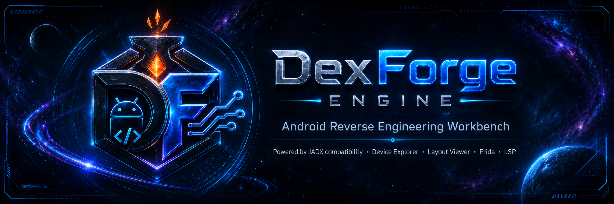
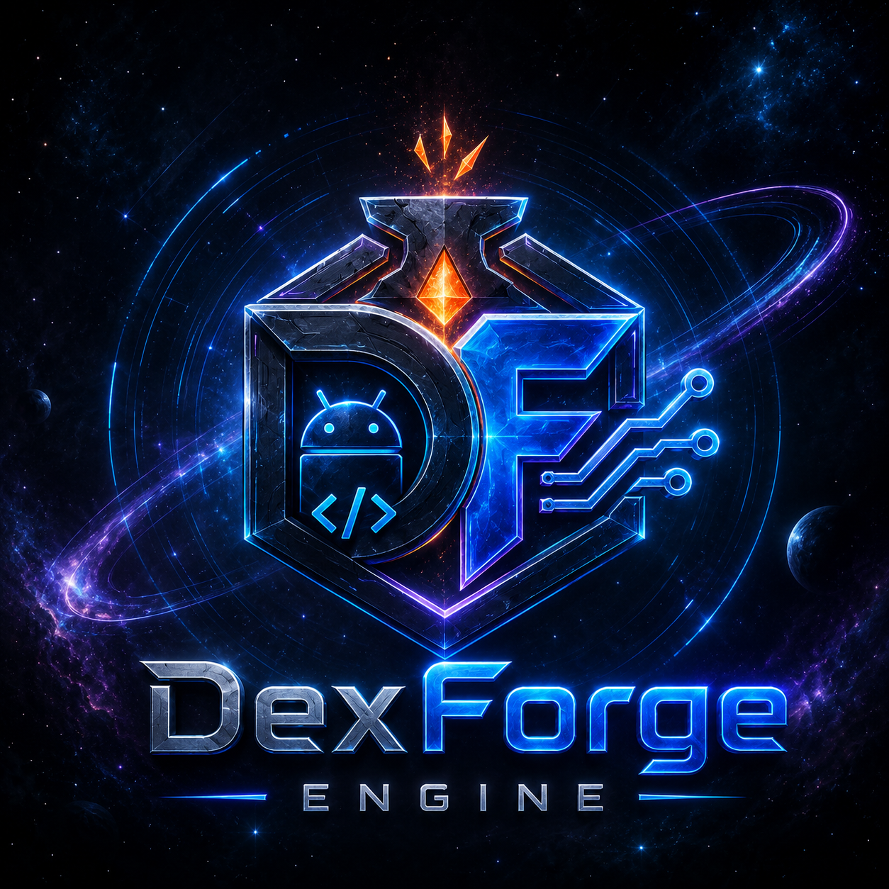

# DexForge Engine

<br/>



<br/>



**DexForge Engine** is an Android reverse engineering workbench powered by the upstream [`skylot/jadx`](https://github.com/skylot/jadx) decompiler.

DexForge adds a modern workflow layer for APK analysis, device extraction, Frida scripting, binary/resource inspection, IDE automation, and Android layout preview.


[](http://www.apache.org/licenses/LICENSE-2.0.html)

---

> [!IMPORTANT]
> **Project Status: Alpha / Development Preview**
> DexForge is actively developed. Some features, commands, or APIs are experimental and subject to change.

> [!WARNING]
> **Legal & Ethical Boundaries**
> DexForge is intended solely for security research, debugging, malware analysis, educational purposes, and recovery of owned/authorized applications. Users are fully responsible for ensuring compliance with all local laws and regulations.

---

## Why DexForge

DexForge is designed for practical Android reverse engineering:
- **Decompile and Inspect**: Convert APK, DEX, AAB, AAR, JAR, class, smali, XAPK, APKM, and APKS inputs to Java or JSON.
- **DexForge Device Explorer**: Pull base and split APKs directly from connected Android devices.
- **DexForge Layout Viewer**: Preview Android XML layout structures visual previews without opening Android Studio.
- **Frida Integration**: Generate Frida hooks directly from GUI decompiler context.
- **Automation Ready**: Expose high-performance JSON-RPC decompiler daemon mode (`lsp`) for IDE integrations.

---

## Repository Architecture

```text
jadx-core/                         - Core decompiler engine logic (upstream-aligned)
dexforge-core/                     - DexForge application/domain layer and JADX adapters
dexforge-cli/                      - CLI frontend wrapper (handles 'lsp', 'device-explorer')
jadx-gui/                          - Swing desktop GUI application
dexforge-plugins/dexforge-frida-integration/
                                  - Frida integration logic and predefined snippet providers
docs/                              - Detailed feature documents, architecture roadmaps, and guides
scripts/                           - Release automation and package helper utilities
```

---

## Development Roadmap

DexForge is structured across several sequential phases of release and capability building:

- **Phase 1 (Rebranding & Baseline)**: Complete user-facing JADX decompiler renaming to DexForge (binaries, UI text, logos) while keeping internal compatibility layers intact. *(Completed)*
- **Phase 2 (Device Explorer)**: Full integration of ADB-driven device package listing, split APK path resolving, extraction, and local workspace initialization. *(Completed)*
- **Phase 3 (Android XML Layout Viewer)**: Embedded Swing-based visual layouts parsing, reference resolving, hierarchy inspector, and attribute sync. *(Completed)*
- **Phase 4 (Frida Script Generator)**: Right-click context hooks builder, local scripts runner panel, and SSL pinning/root detection bypass injections. *(Completed)*
- **Phase 5 (IDE Extensions)**: Public availability of the VS Code (`dexforge-vscode`) and IntelliJ/Android Studio extensions calling the local JSON-RPC decompiler daemon. *(In Progress)*
- **Phase 6 (Public Release)**: Stabilizing APIs, schema structures, and public binary packaging for broad distribution. *(Planned)*

---

## Quick Start

### 1. Download
Download packaged releases from [GitHub Releases](https://github.com/damarkuncoro/jadx-projects/releases/latest).

### 2. Launch
After unpacking the distribution zip, run the executable scripts from `bin/`:

| Command | Purpose |
| --- | --- |
| `dexforge` | Primary DexForge CLI |
| `dexforge-gui` | Primary DexForge GUI |
| `jadx` | Legacy CLI compatibility alias |
| `jadx-gui` | Legacy GUI compatibility alias |

*Note: On Windows, use the corresponding `.bat` files.*

### 3. Build from Source
- **Build Requirement**: JDK 17 or later.
- **Runtime Requirement**: Java 11 or later.

Build distribution zip packages:
```bash
git clone https://github.com/damarkuncoro/jadx-projects.git
cd jadx-projects
./gradlew dist
```

Launch the GUI in development mode:
```bash
./gradlew :jadx-gui:run
```

---

## Documentation

For advanced usages and roadmap specifications:
- [Command-Line & Daemon Usage](docs/CLI_USAGE.md)
- [Project Requirements & Toolchain](docs/PROJECT_REQUIREMENTS.md)
- [DexForge VS Code & IDE Integration Plan](docs/DEXFORGE_REPOSITORIES.md)
- [IDE Integration Quick Start](docs/IDE_INTEGRATION.md)
- [DexForge Rebranding Roadmap Specs](docs/DEXFORGE_REBRANDING_ROADMAP.md)
- [Android XML Layout Viewer Roadmap Specs](docs/ANDROID_XML_LAYOUT_VIEWER_ROADMAP.md)
- [Device Explorer Roadmap Specs](docs/DEVICE_EXPLORER_ROADMAP.md)

---

## Upstream Compatibility

DexForge preserves JADX compatibility where it matters:
- Internal package namespaces (`jadx.*`) and module titles (`jadx-core`, etc.) are kept unchanged to ease upstream merges and maintain plugin compatibility.
- Legacy `jadx` and `jadx-gui` launcher binaries remain shipped alongside `dexforge` commands.
- New DexForge orchestration should grow in `dexforge-core` first, using ports and adapters over `jadx-core` instead of mass-renaming upstream code.

---

*Licensed under the Apache 2.0 License*
